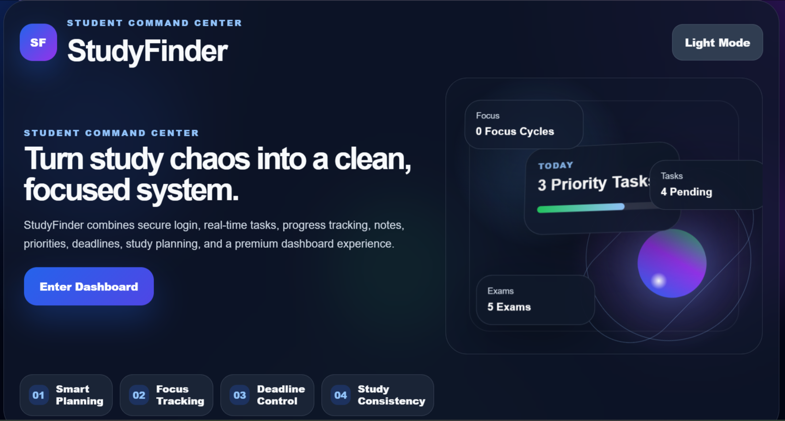
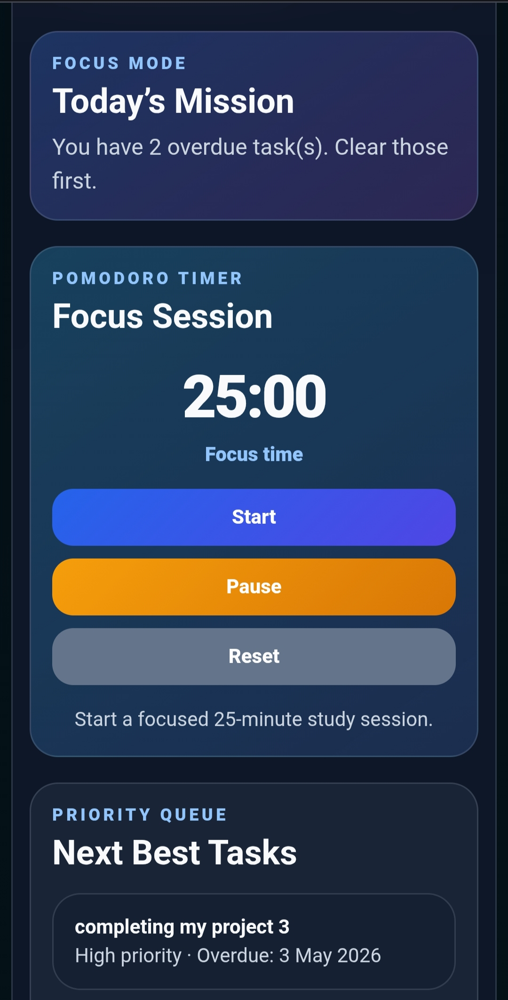

# StudyFinder — Full-Stack Student Productivity Dashboard

StudyFinder is a full-stack student productivity dashboard built with HTML, CSS, vanilla JavaScript, Firebase Authentication, and Cloud Firestore.

It helps students organize tasks, notes, study sessions, focus time, exams, resources, reminders, and progress in one clean dashboard.

---

## Live Demo

Add your deployed link here later:

```text
https://your-live-link-here.com
```

---

## Project Preview





---

## Features

### Authentication

- Email and password signup/login
- Google login
- Password linking support
- Account information panel
- Secure logout

### Task Management

- Add, edit, complete, and delete tasks
- Priority levels
- Due dates
- Overdue task detection
- Task progress tracking
- Search and filter tasks

### Notes

- Personal notes section
- Firestore synced notes
- Auto-loading saved notes after login

### Pomodoro Focus Timer

- 25-minute focus sessions
- 5-minute break sessions
- Start, pause, and reset controls
- Focus session completion tracking
- Break completion handling

### Focus Analytics

- Total completed sessions
- Total focus minutes
- Today’s focus count
- Streak tracking
- Last 7 days focus data
- Best day and average active day
- Focus score

### Study Planner

- Add planned study sessions
- Session date and time tracking
- Real-time Firestore syncing
- Subject tracker
- Weekly plan support

### Exam Countdown

- Add upcoming exams
- Countdown by date
- Upcoming exam alerts
- Revision awareness

### Study Vault

- Save study resources
- Add title, subject, and link
- Organize useful learning materials

### Smart Dashboard

- Today Command Center
- Smart widgets
- Productivity suggestions
- Priority queue
- Study balance score
- Dashboard command search

### Step 45 Smart Systems

- Premium lightweight sound effects
- Sound on/off toggle
- Optional browser notifications
- Smart in-app reminders
- Reminder categories for focus, exams, warnings, productivity, and motivation

### Backup System

- Export local backup
- Import local backup
- Backup includes local exam, vault, and focus data

---

## UI / UX

- Premium landing page
- Orbit-style landing animation
- Dark and light mode
- Responsive mobile layout
- Smooth scrolling
- - Reduced lag and optimized performance
- Final footer and version label

---

## Performance Optimizations

- Reduced unnecessary re-renders
- Lightweight Web Audio API implementation
- Optimized dashboard spacing and layout
- Mobile-safe responsive structure
- Reduced animation-heavy components
- Efficient Firestore syncing flow
- Improved scrolling smoothness
- Cleanup of unnecessary listeners and intervals

---

## Tech Stack

- HTML5
- CSS3
- Vanilla JavaScript
- Firebase Authentication
- Cloud Firestore
- LocalStorage
- Browser Notification API
- Web Audio API

---

## Setup Instructions

```text
1. Clone or download the repository
2. Open the project folder
3. Add your Firebase configuration inside firebase-config.js
4. Enable Firebase Authentication and Cloud Firestore
5. Run the project using Live Server in VS Code
```

---

## Folder Structure

```text
StudyFinder/
│
├── index.html
├── styles.css
├── app.js
├── firebase-config.js
└── README.md
```

---

## Firebase Usage

#### StudyFinder uses Firebase for:

- Authentication
- Cloud Firestore
- Real-time data syncing
- User-specific task storage
- User-specific notes storage
- User-specific study session storage
- Focus analytics syncing

#### The Firebase configuration is kept inside:

- firebase-config.js

---

## LocalStorage Usage

#### Some lightweight local data is stored in the browser using localStorage:

- Theme preference
- Sound preference
- Notification preference
- Dismissed reminders
- Local backup data
- Exam data
- Vault data
- Focus fallback data

---

## What I Learned

#### While building StudyFinder, I practiced:

- Structuring a full web application
- Firebase Authentication
- Cloud Firestore real-time syncing
- DOM manipulation with vanilla JavaScript
- State management without frameworks
- Responsive web design
- UI/UX polishing
- LocalStorage backup systems
- Productivity dashboard logic
- Debugging and performance optimization

---

## Why I Built This

I built StudyFinder to create a real-world student productivity platform that combines planning, focus management, analytics, reminders, and organization in one place.

The project also helped me strengthen my understanding of frontend architecture, Firebase integration, real-time syncing, responsive design, and performance optimization while building a complete full-stack web application from scratch.

---

## Current Version

- StudyFinder v15
- Step 46 Production Polish

---

## Future Improvements

#### Possible future upgrades and expansion ideas:

- PWA install support for app-like experience
- Public production deployment with custom domain
- Firebase Hosting production release
- Mobile application version for Android and iOS
- App Store / Play Store launch preparation
- Calendar-style planner interface
- Advanced productivity analytics and charts
- Cloud-based backup and restore system
- AI-powered study recommendations
- User profile customization
- Team study rooms and collaboration features
- Improved exam revision planning system
- Offline mode support
- Additional accessibility improvements

---

## Author

- Built by Amber Mahajan.

---

## License 

- This project is intended for educational, learning, and portfolio purposes.
